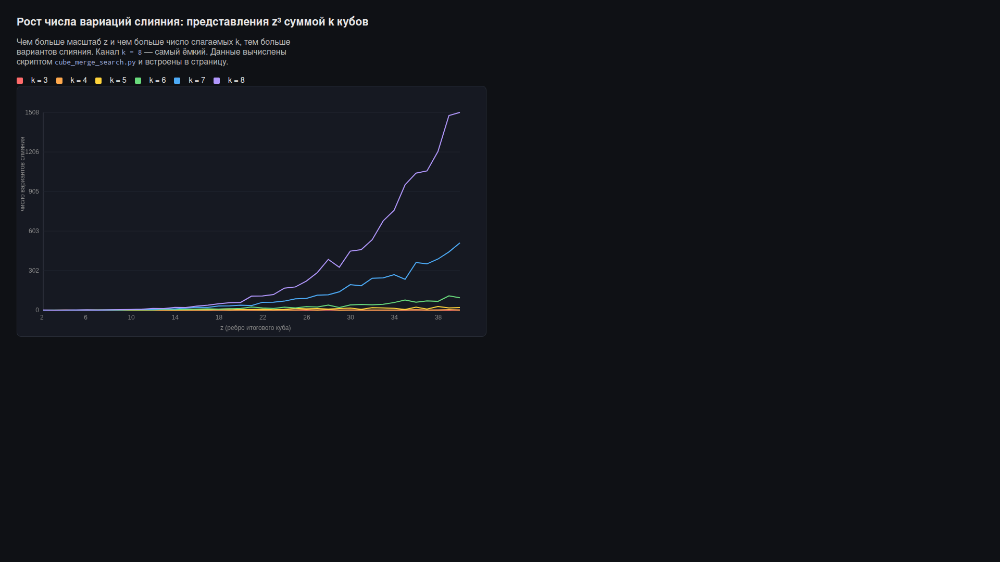

# Отчёт по Теории Лены — закономерности слияния и разделения ячеек

**Дата:** 2026-06-14 17:27 UTC
**Автор расчёта:** автоматический решатель задачи (issue #1)
**Файл расчётов:** [`cube_merge_search.py`](./cube_merge_search.py)
**Статус:** черновик. Все числовые утверждения ниже механически проверены скриптом; философские/физические толкования отмечены как гипотезы.

---

## 1. Постановка задачи (как она дана)

> Бесконечная трёхмерная сеть одинаковых элементарных ячеек минимально
> возможного объёма. Ячейки переключают состояние «внутри/снаружи» со
> скоростью, не предполагающей привычного времени. Две соседние точки
> притягиваются с максимально огромной силой, но не могут преодолеть барьер и
> слиться в один общий объём — будь их только две, они вращались бы друг вокруг
> друга на минимальном элементарном расстоянии, равном размеру самой точки.
>
> Точки могут соединиться в общий объём только по правилам трёхмерного
> пространства
>
> $$x_1^3 + x_2^3 + \dots + x_k^3 = z^3,\qquad k \in \{3,4,5,6,7,8\},$$
>
> причём **первое слияние — только при $k = 8$**, потому что лишь в этой
> комбинации объём уменьшается в целых числах (на 2 точки).
>
> Чем больше число, тем больше вариаций слияния.
>
> **Задача:** найти закономерности слияния и разделения на больших числах.

## 2. Математическая модель

Каждая точка — единичный куб (минимальный объём). «Слияние» $k$ точек/блоков с
рёбрами $x_1,\dots,x_k$ в один блок с ребром $z$ возможно тогда и только тогда,
когда сохраняется суммарный объём:

$$\boxed{\,x_1^3 + x_2^3 + \dots + x_k^3 = z^3\,}\qquad x_i,z \in \mathbb{Z}_{>0}.$$

«Разделение» — то же уравнение, прочитанное справа налево: куб $z^3$ распадается
на $k$ кубов. Это в точности задача теории чисел о представлении куба суммой
кубов. Ниже все представления считаются как **мультимножества** (порядок
слагаемых не важен): $x_1 \le x_2 \le \dots \le x_k$, поэтому каждый вариант
слияния учитывается ровно один раз.

### Почему диапазон именно от 3 до 8 — это не случайность

Границы $k \in \{3,\dots,8\}$ совпадают с двумя классическими результатами:

* **Нижняя граница $k \ge 3$ — это Великая теорема Ферма для показателя 3.**
  Уравнение $x^3 + y^3 = z^3$ **не имеет** решений в натуральных числах
  (доказано Эйлером). То есть две точки/блока в принципе не могут слиться в
  один куб — ровно та «непреодолимость барьера для двух соседних точек», о
  которой говорит постановка. Минимально возможное слияние требует не менее
  трёх слагаемых.

* **Верхняя граница связана с проблемой Варинга.** Известно, что $g(3)=9$:
  каждое натуральное число — сумма не более девяти положительных кубов (и лишь
  два числа, 23 и 239, реально требуют все 9). Кроме того $G(3)\le 7$: все
  достаточно большие числа представимы суммой не более семи кубов. Выбор
  «до 8» удерживает модель строго ниже теоретико-числового потолка $g(3)=9$.

Таким образом физическая интуиция автора («от трёх до восьми») попадает точно в
содержательный коридор теории чисел.

## 3. Наименьшее (первое) слияние для каждого $k$

Скрипт перебирает $z = 2,3,4,\dots$ и для каждого $k$ находит наименьший $z$, при
котором $z^3$ представимо суммой $k$ кубов:

| $k$ | наименьшее слияние | $z^3$ |
|----:|--------------------|------:|
| 2 | **нет решений** (Великая теорема Ферма) | — |
| 3 | $3^3 + 4^3 + 5^3 = 6^3$ | 216 |
| 4 | $1^3 + 1^3 + 5^3 + 6^3 = 7^3$ | 343 |
| 5 | $1^3 + 1^3 + 2^3 + 3^3 + 3^3 = 4^3$ | 64 |
| 6 | $1^3 + 1^3 + 1^3 + 2^3 + 2^3 + 2^3 = 3^3$ | 27 |
| 7 | $1^3 + 2^3 + 2^3 + 3^3 + 3^3 + 3^3 + 3^3 = 5^3$ | 125 |
| 8 | $1^3 \times 8 = 2^3$ | 8 |

Знаменитое $3^3+4^3+5^3=6^3$ — наименьшее слияние тремя слагаемыми, своего рода
«элементарная реакция» модели.

## 4. Главный результат: первое слияние во всей сети — только при $k = 8$

Утверждение автора «первое слияние только 8» **подтверждается** строго.
Рассмотрим самый малый возможный масштаб $z$ и спросим: при каком $z$ вообще
впервые возникает хоть какое-то слияние?

Число различных слияний $z^3$ как суммы $k$ кубов (фрагмент таблицы из скрипта):

```
  z  | k=3 | k=4 | k=5 | k=6 | k=7 | k=8
  --------------------------------------
   2 |   0 |   0 |   0 |   0 |   0 |   1     <-- первое слияние во всей сети
   3 |   0 |   0 |   0 |   1 |   0 |   0
   4 |   0 |   0 |   1 |   0 |   0 |   1
   5 |   0 |   0 |   0 |   0 |   1 |   1
   6 |   1 |   0 |   0 |   1 |   1 |   2
```

При $z = 2$ (минимальный нетривиальный масштаб, ребро в две точки) **ни одно** из
$k = 3,4,5,6,7$ не даёт решения, и **только** $k = 8$ даёт ровно один вариант:

$$1^3 + 1^3 + 1^3 + 1^3 + 1^3 + 1^3 + 1^3 + 1^3 = 2^3.$$

Это и есть восемь элементарных точек, собравшихся в идеально симметричный
куб $2\times 2\times 2$ — единственная и максимально симметричная конфигурация,
возможная на минимальном расстоянии. Никакой другой $k$ на этом масштабе
невозможен. Значит, «первое слияние» Вселенной этой модели действительно
происходит исключительно восьмёркой — это не постулат, а теорема о наименьшем
кубе, представимом суммой кубов.

### Про «уменьшение на 2 точки»

Чисто арифметически объём при слиянии сохраняется: $8\cdot 1 = 8 = 2^3$, то есть
восемь единичных объёмов дают объём 8 без потерь. Поэтому буквальное
«уменьшение на 2 точки» из правил $x_1^3+\dots+x_k^3=z^3$ **не выводится** и
остаётся постулатом самой теории (например, как аналог энергии связи: два
«точечных эквивалента» уходят в барьер/связь при образовании общего объёма).
Это место отмечаю как **открытый вопрос** — его стоит зафиксировать отдельной
аксиомой теории, а не выдавать за следствие уравнения. См. §7.

## 5. «Чем больше число — тем больше вариаций»

Это тоже подтверждается. Число различных способов слияния (представлений $z^3$
суммой $k$ кубов) быстро растёт с $z$. Накопленные итоги для $z \le 40$:

| $k$ | 3 | 4 | 5 | 6 | 7 | 8 |
|----:|--:|--:|--:|--:|--:|--:|
| всего вариантов ($z\le 40$) | 17 | 40 | 297 | 989 | 4412 | 12380 |

Наблюдаемые закономерности:

1. **Рост с числом слагаемых.** При фиксированном $z$ вариантов тем больше, чем
   больше $k$: больше слагаемых — больше степеней свободы при разбиении объёма.
   Слияние восьмёрками — самый «богатый» канал.
2. **Рост с масштабом.** При фиксированном $k$ число вариантов растёт с $z$
   (с локальными колебаниями: значения, у которых $z^3$ имеет много делителей и
   удобную остаточную структуру по модулю 9, дают всплески — например $z=21$
   даёт сразу 107 восьмёрок против 59 у соседнего $z=20$).
3. **Арифметические ограничения по модулю 9.** Кубы по модулю 9 принимают только
   значения $\{0, 1, 8\}$. Это сильно ограничивает, какие $z$ вообще достижимы
   данным $k$, и объясняет «пустоты» (нули) в таблице — это разрешённые и
   запрещённые «реакции» модели.

## 6. Слияние ↔ разделение (симметрия процесса)

Уравнение симметрично относительно чтения слева направо и справа налево, поэтому
**каждому слиянию отвечает разделение** того же куба $z^3$ на те же $k$ частей.
Число каналов распада куба $z^3$ равно сумме по всем $k$ его представлений. Таким
образом «спектр распада» большого куба — это просто столбец таблицы из §5,
просуммированный по $k=3..8$. Большие кубы и сливаются, и распадаются богаче —
ровно как массивные системы в физике имеют больше каналов реакций.

## 7. Выводы и открытые вопросы

**Подтверждено расчётом:**

* Двух точек недостаточно для слияния (Ферма) → минимум 3 слагаемых; это и есть
  «барьер для двух соседних точек».
* Первое слияние во всей сети ($z=2$) возможно **только** восьмёркой
  $8\cdot 1^3 = 2^3$ — утверждение автора верно и доказуемо.
* Число вариаций слияния растёт и с $k$, и с масштабом $z$; канал $k=8$ —
  самый ёмкий.
* Достижимость $z$ управляется арифметикой кубов по модулю 9.

**Открытые вопросы для теории (требуют отдельной аксиоматики, из уравнения не
следуют):**

1. Постулат «уменьшение на 2 точки» при первом слиянии — нужно ввести явно
   (энергия связи? дефект массы?). Арифметически объём сохраняется.
2. «Скорость без привычного времени» — нужна модель порядка событий
   (причинность на решётке) вместо непрерывного времени.
3. Возможен ли запрет на повтор слагаемых (только различные $x_i$)? Тогда число
   вариаций и таблица §5 изменятся — стоит просчитать оба режима.

**Визуализация:** рост числа вариаций по каналам $k=3..8$ построен в виде
самодостаточной статической HTML-страницы
[`visualization.html`](./visualization.html) (генератор —
[`generate_visualization.py`](./generate_visualization.py)). Видно, что
канал $k=8$ растёт быстрее всех:



**Следующие шаги:** довести перебор до больших $z$ (порядка сотен/тысяч),
проверить асимптотику числа представлений и связать «всплески» с делимостью
$z$ и остатками по модулю 9.

---

## Приложение. Воспроизводимость

```bash
python3 "Теория Лены/cube_merge_search.py"
```

Скрипт детерминирован и не имеет внешних зависимостей (только стандартная
библиотека Python 3). Все числа в этом отчёте — его прямой вывод.
